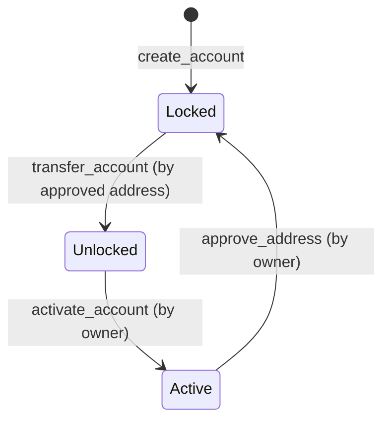

# ATP - Account Transfer Protocol

ATP (Account Transfer Protocol) is a protocol designed for transferring entire accounts across different blockchains or within the same blockchain. Unlike traditional methods that transfer individual assets, ATP treats an account as a unified object that can contain multiple assets (tokens, NFTs, DeFi positions, etc.).

## Key Features

- **Entire Account Transfer**: Transfer all assets in an account at once rather than individual tokens
- **Cross-Chain Flexibility**: Move accounts across different blockchain ecosystems
- **Secure Key Management**: Uses Internet Computer's threshold ECDSA and Schnorr signing capabilities
- **State-Based Security Model**: Accounts transition through different states (Locked, Unlocked, Active) to ensure secure transfers

## Documentation

For detailed documentation, see the following:

- [Overview](./docs/overview.md) - Concept and key features
- [Architecture](./docs/architecture.md) - Implementation details and state transitions
- [API Reference](./docs/api_reference.md) - Endpoint documentation
- [Getting Started](./docs/getting_started.md) - Setup and testing guide
- [Integration Guide](./docs/integration_guide.md) - How to integrate with other canisters
- [Contribution Guide](./docs/contribution_guide.md) - How to contribute to ATP

## Quick Start

```bash
# Install the DFINITY SDK if you haven't already
sh -ci "$(curl -fsSL https://internetcomputer.org/install.sh)"

# Clone the repository
git clone https://github.com/mycel-labs/atp
cd atp

# Start the local Internet Computer replica
dfx start --background

# Deploy the ATP canister
dfx deploy
```

## State Transitions

Accounts in ATP go through various state transitions:



## Key Endpoints

- `create_account`: Create a new account with specified algorithm and curve
- `transfer_account`: Transfer account ownership to another principal
- `activate_account`: Activate an unlocked account
- `sign`: Sign a message with the account's private key
- `sign_eip1559_transaction`: Sign an Ethereum transaction

For more details, see the [API Reference](./docs/api_reference.md).

## Resources
- [Internet Computer Documentation](https://internetcomputer.org/docs)
- [Rust Canister Development Guide](https://internetcomputer.org/docs/current/developer-docs/backend/rust/)
- [Candid Introduction](https://internetcomputer.org/docs/current/developer-docs/backend/candid/)
