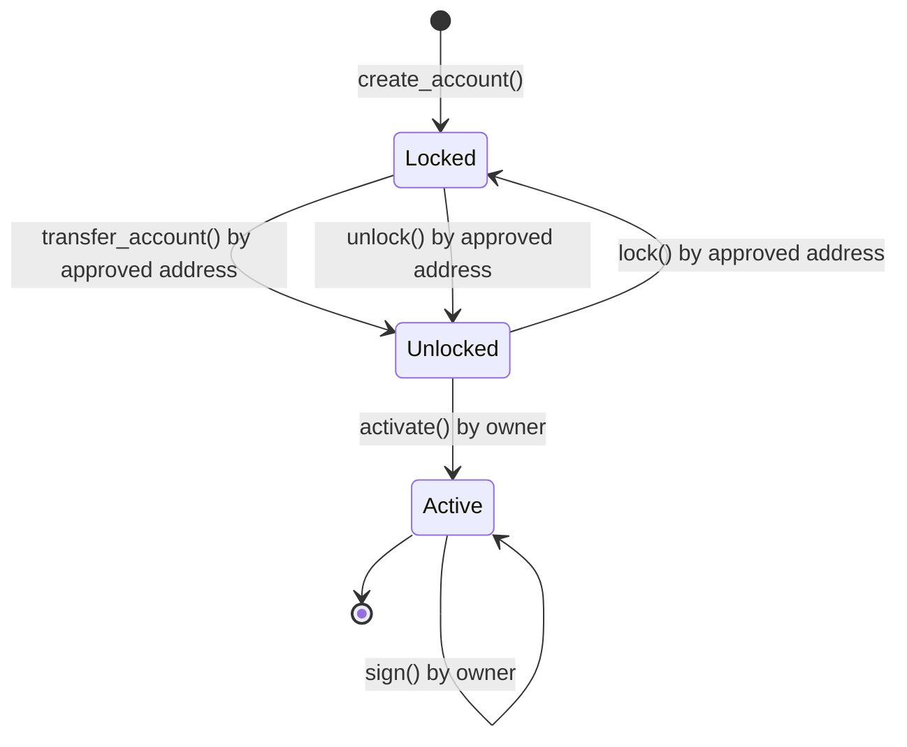

# ATP Architecture and Implementation

ATP is implemented as a canister (smart contract) on the Internet Computer using Rust. It follows a clean architecture pattern with distinct layers:

## Architecture Layers

### Domain Layer

Contains the core business logic and models that define what an account is and how it behaves.

### Application Layer

Implements use cases and services that orchestrate domain objects to fulfill business requirements.

### Infrastructure Layer

Provides concrete implementations for repositories and external services.

### Endpoints Layer

Exposes the API to consumers through Candid interfaces.

## Key Components

- **Account**: The main entity representing a transferable account with properties like owner, public key, and state
- **SignerRepository**: Manages cryptographic operations using Internet Computer's threshold signature schemes
- **AccountRepository**: Stores and retrieves account data
- **AccountService**: Orchestrates operations on accounts

## State Transitions

Accounts in ATP go through various state transitions during their lifecycle:

### Account States

1. **Locked**: The initial state of an account after creation. In this state:
   - The account is owned by the creator
   - An approved address (usually an application like a DEX) is set
   - Only the approved address can transfer or unlock the account

2. **Unlocked**: An intermediate state after transfer. In this state:
   - The account has a new owner
   - The owner must activate the account to use it
   - No approved address exists in this state

3. **Active**: The final state where the account can be used. In this state:
   - The owner can sign messages and transactions
   - The owner can approve addresses for future transfers
   - Only the owner can perform actions with the account

### State Transition Diagram

